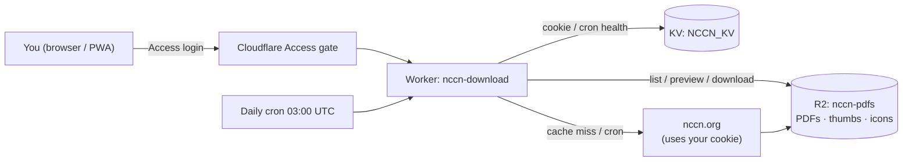

# NCCN Guidelines Downloader

[](https://github.com/htlin222/nccn-guidelines-downloader/actions/workflows/deploy.yml)
[](https://github.com/htlin222/nccn-guidelines-downloader/actions/workflows/update-versions.yml)

     

Two ways to grab [NCCN Clinical Practice Guidelines](https://www.nccn.org/) PDFs with
**your own** NCCN account:

1. **CLI** — a small `curl` script that downloads guidelines to your machine.
2. **Web app** — a Cloudflare Worker that turns your account into a private,
   installable PWA: a categorized card wall with first-page thumbnails, in-browser
   pdf.js preview, one-click download, an R2 cache, and a daily cron that keeps every
   guideline fresh — the whole thing locked behind a Cloudflare Access login.

> ⚠️ **You still need a valid NCCN login.** This project does not bypass NCCN
> authentication — it reuses *your* session cookie to fetch the same PDFs you can
> already download by hand. Guideline content is © NCCN; keep copies for personal
> clinical use and respect NCCN's terms.

---

## Table of contents

- [Quick start (CLI)](#quick-start-cli)
- [Web app (Cloudflare)](#web-app-cloudflare)
  - [What you get](#what-you-get)
  - [Architecture](#architecture)
  - [Deploy it yourself](#deploy-it-yourself)
  - [Day-to-day](#day-to-day)
- [Guideline filename reference](#guideline-filename-reference)
- [Security notes](#security-notes)

---

## Quick start (CLI)

```bash
# 1. Get your cookie: install cookie-cook (https://github.com/gaoliang/cookie-cook),
#    log in at nccn.org, copy the "Http Header value", save it as cookie.txt
cp cookie.txt.example cookie.txt   # then paste your cookie in, strip the comments

# 2a. One guideline (fzf picker if no arg):
sh nccn.sh t-cell            # → NCCN-t-cell-YYYY-MM-DD.pdf

# 2b. A batch: list ids (one per line) in nccnlist.txt, then:
sh batch_nccn_from_list.sh
```

Find the id for any cancer type in the [filename reference](#guideline-filename-reference)
below (or in `nccn_dict.txt`, which also feeds the fzf picker).

---

## Web app (Cloudflare)

Everything for the web app lives in [`cf/`](cf/) and is documented in detail in
[`cf/README.md`](cf/README.md). Highlights:

### What you get

| Feature | Details |
|---------|---------|
| 🔐 **Private** | Whole hostname gated by **Cloudflare Access** — only your allow-listed emails get in (email OTP or your IdP). |
| 🗂️ **Card wall** | shadcn-styled, light/dark, [lucide](https://lucide.dev) icons, installable **PWA** (offline app shell + cached thumbnails). |
| 🩺 **Categorized** | 86 guidelines grouped by oncology subspecialty — Hematology, GI, Thoracic, GU, Gyn, Skin, CNS, Pediatric, Supportive Care, Genetics, … |
| 🖼️ **Thumbnails** | First-page preview image per guideline (generated with `pdftoppm` → webp, stored in R2). |
| 👁️ **In-browser preview** | Full **pdf.js** viewer with zoom — no download needed. |
| ⬇️ **Download** | One click; served from the R2 cache, falls back to a live NCCN fetch. |
| ♻️ **Self-healing refresh** | Daily cron re-pulls the 3 stalest copies → every guideline renewed ≈ monthly. A failed fetch stays stalest, so it is retried until it lands instead of being skipped. |
| 🔑 **Cookie self-service** | Paste a fresh NCCN cookie right in the (gated) page when it expires — stored in KV, no redeploy. |

### Architecture



- **Worker** serves the page, the pdf.js viewer, the PDFs, thumbnails, PWA manifest &
  service worker, and a tiny JSON API (`/api/cookie`, `/api/r2-status`, `/api/refresh`).
- **R2** (`nccn-pdfs`) caches every PDF (`<id>.pdf`), its thumbnail (`thumb/<id>.webp`),
  and the app icons (`asset/*`).
- **KV** (`NCCN_KV`) holds the NCCN cookie, its update timestamp, and the cron's health record.
- **Access** restricts the hostname; the id of every request is validated against the
  built-in allow-list (no arbitrary path fetch).

### Deploy it yourself

Prereqs: a Cloudflare account with a proxied zone, [`wrangler`](https://developers.cloudflare.com/workers/wrangler/),
`pdftoppm` + `cwebp` (for thumbnails), and the [`cf-gate`](#) flow (or the dashboard) for Access.

```bash
cd cf
wrangler kv namespace create NCCN_KV      # paste the id into wrangler.jsonc
wrangler r2 bucket create nccn-pdfs
# set the custom domain / route in wrangler.jsonc, then:
wrangler deploy

# seed the cache + thumbnails (needs ../cookie.txt):
bash seed_r2.sh          # download all 86 PDFs into R2
bash gen_thumbs.sh       # render first-page thumbnails into R2

# gate the hostname to your emails (Cloudflare Access), e.g. via cf-gate:
#   cf-gate gate nccn.example.com you@example.com
```

Full command reference, cron tuning (`PER_DAY`), and troubleshooting: **[`cf/README.md`](cf/README.md)**.

### Day-to-day

- **Cookie expired?** Open the site → *Update NCCN cookie* → paste → save. Done.
- **Force a full refresh:** `bash cf/seed_r2.sh` (or `POST /api/refresh?n=25` while logged in).
- **Watch the cron:** `wrangler tail nccn-download`.

---

## Guideline filename reference

The `id` is the NCCN PDF slug (`https://www.nccn.org/professionals/physician_gls/pdf/<id>.pdf`).

| Cancer Type | id |
| --- | --- |
| Acute Lymphoblastic Leukemia | `all` |
| Acute Myeloid Leukemia | `aml` |
| Ampullary Adenocarcinoma | `ampullary` |
| Anal Carcinoma | `anal` |
| Basal Cell Skin Cancer | `nmsc` |
| B-Cell Lymphomas | `b-cell` |
| Biliary Tract Cancers | `btc` |
| Bladder Cancer | `bladder` |
| Bone Cancer | `bone` |
| Breast Cancer | `breast` |
| Central Nervous System Cancers | `cns` |
| Cervical Cancer | `cervical` |
| Chronic Lymphocytic Leukemia/SLL | `cll` |
| Chronic Myeloid Leukemia | `cml` |
| Colon Cancer | `colon` |
| Dermatofibrosarcoma Protuberans | `dfsp` |
| Esophageal and EGJ Cancers | `esophageal` |
| Gastric Cancer | `gastric` |
| Gastrointestinal Stromal Tumors | `gist` |
| Gestational Trophoblastic Neoplasia | `gtn` |
| Hairy Cell Leukemia | `hairy_cell` |
| Head and Neck Cancers | `head-and-neck` |
| Hepatobiliary Cancers | `hepatobiliary` |
| Hepatocellular Carcinoma | `hcc` |
| Histiocytic Neoplasms | `histiocytic_neoplasms` |
| Hodgkin Lymphoma | `hodgkins` |
| Kaposi Sarcoma | `kaposi` |
| Kidney Cancer | `kidney` |
| Melanoma: Cutaneous | `cutaneous_melanoma` |
| Melanoma: Uveal | `uveal` |
| Merkel Cell Carcinoma | `mcc` |
| Mesothelioma: Peritoneal | `meso_peritoneal` |
| Mesothelioma: Pleural | `meso_pleural` |
| Multiple Myeloma | `Myeloma` |
| Myelodysplastic Syndromes | `mds` |
| Myeloid/Lymphoid Neoplasms w/ Eosinophilia | `mlne` |
| Myeloproliferative Neoplasms | `mpn` |
| Neuroendocrine and Adrenal Tumors | `neuroendocrine` |
| Non-Small Cell Lung Cancer | `nscl` |
| Occult Primary | `occult` |
| Ovarian/Fallopian Tube/Primary Peritoneal | `ovarian` |
| Pancreatic Adenocarcinoma | `pancreatic` |
| Pediatric ALL | `ped_all` |
| Pediatric Aggressive Mature B-Cell Lymphomas | `ped_b-cell` |
| Pediatric CNS Cancers | `ped_cns` |
| Pediatric Hodgkin Lymphoma | `ped_hodgkin` |
| Penile Cancer | `penile` |
| Primary Cutaneous Lymphomas | `cutaneous_lymphomas` |
| Prostate Cancer | `prostate` |
| Rectal Cancer | `rectal` |
| Small Bowel Adenocarcinoma | `small_bowel` |
| Small Cell Lung Cancer | `sclc` |
| Soft Tissue Sarcoma | `sarcoma` |
| Squamous Cell Skin Cancer | `squamous` |
| Systemic Light Chain Amyloidosis | `amyloidosis` |
| Systemic Mastocytosis | `mastocytosis` |
| T-Cell Lymphomas | `t-cell` |
| Testicular Cancer | `testicular` |
| Thymomas and Thymic Carcinomas | `thymic` |
| Thyroid Carcinoma | `thyroid` |
| Uterine Neoplasms | `uterine` |
| Vulvar Cancer | `vulvar` |
| Waldenström Macroglobulinemia / LPL | `waldenstroms` |
| Wilms Tumor (Nephroblastoma) | `wilms_tumor` |

<details>
<summary><b>Supportive care, screening, prevention & genetics</b></summary>

| Guideline | id |
| --- | --- |
| Antiemesis | `antiemesis` |
| Adult Cancer Pain | `pain` |
| Cancer-Associated VTE | `vte` |
| Cancer-Related Fatigue | `fatigue` |
| Distress Management | `distress` |
| Hematopoietic Cell Transplantation | `hct` |
| Hematopoietic Growth Factors | `growthfactors` |
| Immunotherapy-Related Toxicities | `immunotherapy` |
| Palliative Care | `palliative` |
| Cancer-Related Infections | `infections` |
| Smoking Cessation | `smoking` |
| Survivorship | `survivorship` |
| AYA Oncology | `aya` |
| Older Adult Oncology | `older_adult` |
| Cancer in People with HIV | `hiv` |
| Breast Cancer Risk Reduction | `breast_risk` |
| Breast Cancer Screening and Diagnosis | `breast-screening` |
| Colorectal Cancer Screening | `colorectal_screening` |
| Genetics — Breast, Ovarian, Pancreatic | `genetics_bopp` |
| Genetics — Colorectal | `genetics_ceg` |
| Lung Cancer Screening | `lung_screening` |
| Prostate Cancer Early Detection | `prostate_detection` |

</details>

> **Note:** NCCN occasionally renames PDFs. A few slugs already shifted
> (`primary_cutaneous → cutaneous_lymphomas`, `genetics_bop → genetics_bopp`,
> `genetics_colon → genetics_ceg`). The Worker follows NCCN redirects on live fetches,
> so live downloads survive future renames even before the built-in list is updated.

---

## Security notes

- **`cookie.txt` is a live credential.** It is gitignored; never commit it. Use
  `cookie.txt.example` as the template.
- **The web app stores your cookie in Cloudflare KV**, reachable only by your Worker,
  and the site is fenced by Cloudflare Access — but treat the deployment as holding a
  credential and keep the Access allow-list tight.
- **Nothing here circumvents NCCN auth.** No login, entitlement, or paywall is bypassed;
  the tools act with your own authenticated session only.
- Guideline PDFs are © NCCN — for personal clinical reference, not redistribution.
